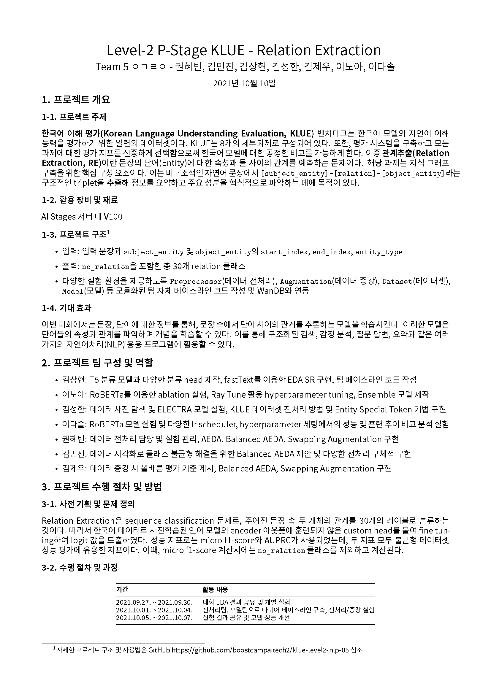
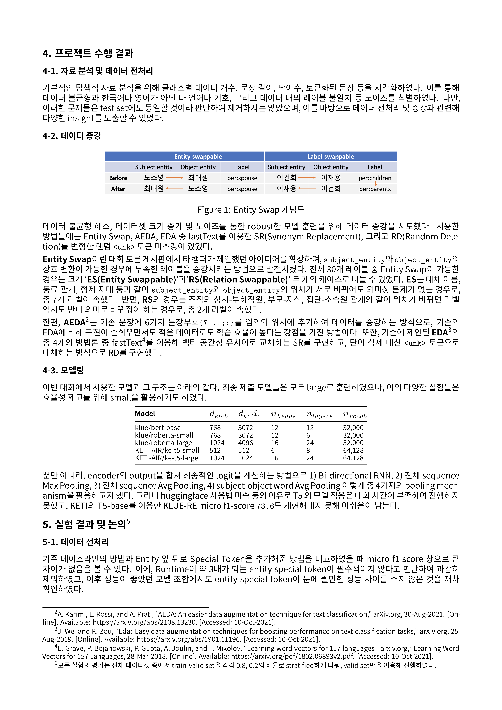
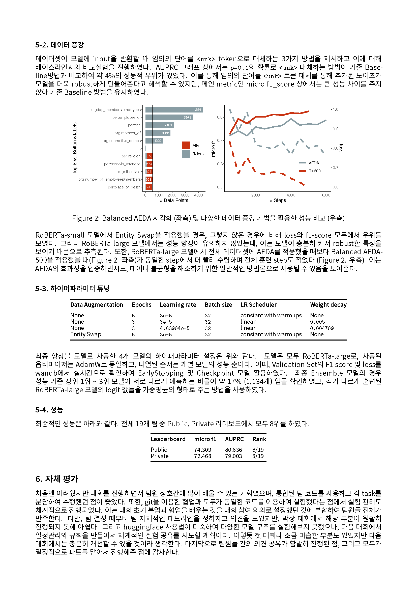

# KLUE LEVEL2 NLP Team 5 - ㅇㄱㄹㅇ

리포트는 [하단](#report)에 있습니다.

# Instruction

## Data Augmentation

모델을 학습하기 전에, 데이터 수 증가를 위해 여러 Data Augmentation기법을 수행합니다.<br>
Augmentation을 적용한 데이터셋들은 "/opt/ml/dataset" 하위로 생성됩니다.

### AEDA (No Validation)
이 데이터셋을 사용하기 전에 아래 파이썬 파일을 꼭 실행하세요.
```bash
python aeda_augmentation.py
```
해당 데이터셋 사용할 때 추가할 command line arguments 예시
```bash
--data_dir /opt/ml/dataset/aeda_1_dataset
# --data_dir /opt/ml/dataset/aeda_2_dataset
# --data_dir /opt/ml/dataset/aeda_4_dataset
# --data_dir /opt/ml/dataset/aeda_8_dataset
```

### AEDA (For Validation)
이 데이터셋을 사용하기 전에 아래 파이썬 파일을 꼭 실행하세요.
```bash
python aeda_val_split.py
```
사용 예시
```bash
--data_dir /opt/ml/dataset/aeda_1_dataset --val_file y
# --data_dir /opt/ml/dataset/aeda_2_dataset --val_file y
# --data_dir /opt/ml/dataset/aeda_4_dataset --val_file y
# --data_dir /opt/ml/dataset/aeda_8_dataset --val_file y
```

### AEDA Balanced (No Validation)
이 데이터셋을 사용하기 전에 아래 파이썬 파일을 꼭 실행하세요.
```bash
python aeda_bal_augmentation.py
```
사용 예시: 
```bash
--data_dir /opt/ml/dataset/aeda_bal300_dataset 
# --data_dir /opt/ml/dataset/aeda_bal500_dataset 
```

### AEDA Balanced (for Validation)
이 데이터셋을 사용하기 전에 아래 파이썬 파일을 꼭 실행하세요.
실행 시, "/opt/ml/dataset/aeda_bal300_dataset" 과 "/opt/ml/dataset/aeda_bal500_dataset" 아래에 train.csv, valid.csv 파일을 각각 생성합니다.

```bash
python aeda_bal_val_split.py
```
사용 예시: 
```bash
--data_dir /opt/ml/dataset/aeda_bal300_dataset --val_file y
# --data_dir /opt/ml/dataset/aeda_bal500_dataset  --val_file y
```

### Swap
이 데이터셋을 사용하기 전에 아래 파이썬 파일을 꼭 실행하세요.
```bash
python swap_augmentation.py
```
사용 예시:
```bash
--data_dir /opt/ml/dataset/swap_dataset 
```
Validation set을 사용하기 위해서는 아래 command line argument를 추가하세요.
```
--data_dir /opt/ml/dataset/swap_dataset --val_file n
```

### Load augmented data

아래의 argument를 추가하면 사전에 augmentation이 이루어진 data를 받습니다. `--data_dir` 내의 하부 디렉토리에서 가져옵니다.

```bash
--additional folder1/train.csv folder2/train.csv
```

예를 들어, `--data_dir /opt/ml/dataset`으로 지정되어 있다면, `/opt/ml/dataset/folder1/train.csv`, `/opt/ml/dataset/folder2/train.csv`를 불러오게 됩니다.

## How to train

대회에서 주어진 베이스라인 코드를 바탕으로, 다양한 옵션을 이용해 실험할 수 있도록 구성하였습니다. 아래의 코드로 대회 초기에 주어진 baseline setting 그대로 돌릴 수 있습니다. 

### Baseline Model (klue/bert-base)

```bash
python train.py --verbose y --name exp_baseline --model klue/bert-base --dataset BaselineDataset --data_dir /opt/ml/dataset --preprocessor BaselinePreprocessor --epochs 1 --lr 1e-3
```

### Electra

```bash
python train.py --verbose y --name exp_electra --model kykim/electra-kor-base --dataset BaselineDataset --data_dir /opt/ml/dataset --preprocessor BaselinePreprocessor --epochs 1 --lr 1e-3
```

### Roberta

```bash
python train.py --verbose y --name exp_roberta --model klue/roberta-large --dataset BaselineDataset --data_dir /opt/ml/dataset --preprocessor BaselinePreprocessor --epochs 1 --lr 1e-3
```

```bash
python train.py --verbose y --name exp_roberta --model klue/roberta-base --dataset BaselineDataset --data_dir /opt/ml/dataset --preprocessor BaselinePreprocessor --epochs 1 --lr 1e-3
```

```bash
python train.py --verbose y --name exp_roberta --model klue/roberta-small --dataset BaselineDataset --data_dir /opt/ml/dataset --preprocessor BaselinePreprocessor --epochs 1 --lr 1e-3
```

### T5

```bash
python train.py --verbose y --name exp_t5 --model KE-T5-large --dataset T5Dataset --data_dir /opt/ml/dataset --preprocessor T5BasicPreprocessor --epochs 1 --lr 1e-3
```

```bash
python train.py --verbose y --name exp_t5 --model KE-T5-base --dataset T5Dataset --data_dir /opt/ml/dataset --preprocessor T5BasicPreprocessor --epochs 1 --lr 1e-3
```

```bash
python train.py --verbose y --name exp_t5 --model KE-T5-small --dataset T5Dataset --data_dir /opt/ml/dataset --preprocessor T5BasicPreprocessor --epochs 1 --lr 1e-3
```

### Help

자세한 commandline arguments에 대한 내용은 아래의 명령어로 확인이 가능합니다.

```bash
python train.py --help
```

### Final Submission

대회에 최종으로 제출한 setting은 아래와 같습니다.

```bash
python train.py
```

## How to inference

### command

```bash
python inference.py
```

### Arguments

```bash
--model_dir     # inference에서 사용할 모델이 저장된 경로 (ex. ./saved/exp/exp_final)
--is_roberta    # 모델의 RoBERTa 여부, token_type_ids 사용 여부 결정 (default: n)
--tokenizer     # tokenizer 이름 (default: klue/bert-base)
--dataset       # dataset class (default: BaselineDataset)
--preprocessor  # preprocessor class (default: BaselinePreprocessor)
```

## Features

가장 큰 특징들은 아래와 같습니다.

* huggingface 내 모델뿐만 아니라 model 폴더 내에 저장된 custom model을 commandline argument로 자동으로 불러옵니다. 따라서 다양한 pretrained 모델을 명령만을 통해서 사용할 수 있도록 편의성을 높이면서도, 다양한 모델 구조를 실험할 수 있도록 자유도를 높였습니다. (다만, 모델에 적합한 input에 맞게 `Preprocessor`를 생성해야 합니다.)

* 다양한 전처리, 모델의 실험을 코드의 최소한의 변형만으로 가능하도록 만들었습니다.

* wandb가 연동되어 훈련을 실시간으로 분석하고, 모델들을 관리할 수 있습니다. 또한, 이를 바탕으로 hyperparameter search를 수행할 수도 있습니다.

* `Preprocessor`를 상속받는 subclass `preprocessor` object를 만들어서 다양한 전처리를 시도할 수 있습니다. 또한, 구현된 여러 개의 전처리를 모두 사용할 수 있습니다.

* `Augmentation`을 상속받는 subclass `augmentation` object를 만들어서 다양한 augmentation을 시도할 수 있습니다. 마찬가지로 구현된 여러 개의 데이터 증강 기법을 모두 사용할 수 있습니다.

## TODO List

- [X] 다양한 모델(T5 등)의 input에 적합한 `Preprocessor` 클래스 개발
- [X] EDA 논문에 나온 Augmentation 구현
- [X] Word2Vec 혹은 FastText 기반의 유의어 사전 구축 및 Augmentation 구현
- [X] train-valid split 구현 (stratified)
- [X] huggingface `Trainer`에 다양한 optimizer 옵션 추가 (예를 들어, `--optim` 옵션은 정상으로 작동하지 않습니다.)

# Structure

## File Structure

ㅇㄱㄹㅇ팀 베이스라인 코드는 아래와 같은 구조로 되어 있습니다.

<details>
  <summary>Click to expand!</summary>

  ```
.
|-- README.md
|-- dataset
|   |-- augmentation
|   |   `-- augmentations.py
|   |-- dataset.py
|   |-- preprocessor
|   |   |-- preprocessors.py
|   |   `-- regex.py
|   `-- transform.py
|-- exp.ipynb
|-- infer.py
|-- ipynb
|-- model
|   `-- models.py
|-- requirements.txt
`-- train.py
  ```
</details>

## Class 설명

### `dataset.preprocessor.preprocessors`:

#### `Preprocessor` class

* 기본적인 구현은 `pandas.DataFrame`을 받아서 원하는 대로 가공하는 역할을 수행합니다.

* 해당 클래스를 호출(`preprocessor(data: pd.DataFrame)`)하면 변형된 형태의 `pandas.DataFrame`을 반환해야 합니다.

* 현재 추상 클래스 `Preprocessor`를 상속받는 클래스는 1개 `BaselinePreprocessor`가 구현되어 있습니다. 이는 베이스라인 코드가 하는 역할과 거의 유사합니다.

#### `BaselinePreprocessor` class

* `BaselinePreprocessor`가 수행하는 역할은 넘겨받은 data의 라벨을 `subject_entity`, `object_entity`, `concat_entity`, `label`로 나누는 역할을 수행합니다. 

* 이후, `concat_entity`는 `BaselineDataset`에서 `sentence`와 함께 모델의 입력값으로 주어지게 되며, 둘을 구분하기 위해 `token_type_ids`가 추가된 채로 모델에 주어집니다.

----------

### `dataset.augmentation.augmentations`:

* 기본적인 구현은 개별 sentence `str`를 입력으로 받아 가공하는 것입니다.

* sentence가 `dataset.tokenizer`에 의해 토큰화되기 전에 이루어집니다. 해당 이유는 한국어 특성상 word 단위가 아닌 subword 기반의 토큰화를 사용하게 되는데, 이 경우 처리가 상당히 까다롭기 때문입니다.

* 해당 클래스를 호출(`augmentation(input_text: str)`)하면 가공된 형태의 `str`을 반환해야 합니다.

* 현재 총 3개의 추상 클래스 `Augmentation`을 상속받은 클래스가 구현되어 있습니다.

#### `SimpleRandomUNK` class

* `__init__(unk_token: str, unk_ratio: float = 0.15)`

* `unk_token`은 일반적으로 tokenizer에서 반환되는 토큰을 입력하게 됩니다.

* `unk_ratio`는 `<unk>` 토큰으로 처리할 단어의 비율을 정합니다. 전체 단어 수 (띄어쓰기 기준) 중에서 해당 비율만큼 (확률적으로) `<unk>` 토큰으로 대체됩니다.

#### `UNKWithInputMask` class

* 입력값으로 `input_mask`를 받아, `input_mask`의 `0`으로 주어진 곳의 단어에 대해서만 **모두** `<unk>` 토큰으로 대체합니다.

#### `RandomUNKWithInputMask` class

* 위의 `SimpleRandomUnk`와 `UnkWithInputMask` 클래스의 기능을 모두 수행합니다. 입력값으로는 `input_mask`를 받습니다.

* `input_mask`의 `0`으로 주어진 곳의 단어에 대해서만 **확률적으로** `<unk>` 토큰으로 대체하며, `1`로 주어진 곳은 절대로 대체되지 않습니다. 

* 착오 및 실수로 인해 `input_text`의 단어수와 `input_mask`의 개수가 다르더라도, 이를 에러 없이 처리하는 코드가 들어 있어 노이즈에 대응합니다. 

* `compensate = True`일 경우, `input_mask`가 씌워진 비율만큼 `unk_ratio`를 보정하여 확률적으로 마스크를 씌웁니다.

* `compensate = True`가 기본값이며, `conpensate = False`일 경우는 `unk_ratio`로 초기화된 값과보다 훨씬 적은 비율의 마스크가 씌워질 가능성이 있습니다.

# Arguments

## Container Environments

```bash
--data_dir {data_directory}   # default: /opt/ml/dataset
--model_dir {model_directory} # default: ./saved
--log_dir {model_directory}   # default: ./logs
```

## Model Setting

If saved model directory is given to `--load_model`, then it will load the pretrained weights.

```bash
--name {save_name}           # please set the model name
--model {model_type}         # model type (e.g., klue/bert-base)
--load_model {model_dir}     # if set, load a custom pretrained model
--num_labels {num_labels}    # num_labels (default: 30)
```

## Dataset and DataLoader

```bash
--dataset {dataset}            # dataset class name (default: BaselineDataset)
--additional {file1 file2 ...} # list of additional dataset file names (will be concated)
--batch_size {B}               # batch size (default: 1)
--val_file {y or n}            # if y, read train/valid.csv and create valid_dataset (default: n)
--val_ratio {val_ratio}        # stratified train-valid split ratio (default: 0.2)
                               # if val_ratio == 0 and val_file == n, 
                               # then evaluate with the whole training data
--val_batch_size {batch_size}  # default set to batch_size
```

## Preprocessor and Augmentation

```bash
--preprocessor {prp_type}    # default: BaselinePreprocessor
--augmentation {aug_type}    # default: None
```

## Training Setup

```bash
--epochs {N}          # number of epochs (default: 1)
--lr {LEARNING_RATE}  # learning rate (default: 1e-5)
--lr_type {TYPE}      # lr scheduler type (default: constant)
                      # other options: linear
--lr_weight_decay {R} # lr weight decay rate for AdamW (default: 0.01)
--max_seq_len {L}     # max sequence length (default: 256)
--max_pad_len {L}     # max padding length for bucketing (default: 8)
                      # ignored in this setting
```

## Trainer Setup

```bash
--log_every {N}     # log every N steps (default: 500)
--eval_every {N}    # evaluation interval for every N steps (default: 500)
--save_every {N}    # save model interval for every N steps (default: 500)
```

## Additional Setting

```bash
--seed {seed_value}  # default: None
--verbose {y or n}   # y or n
```

# Report





